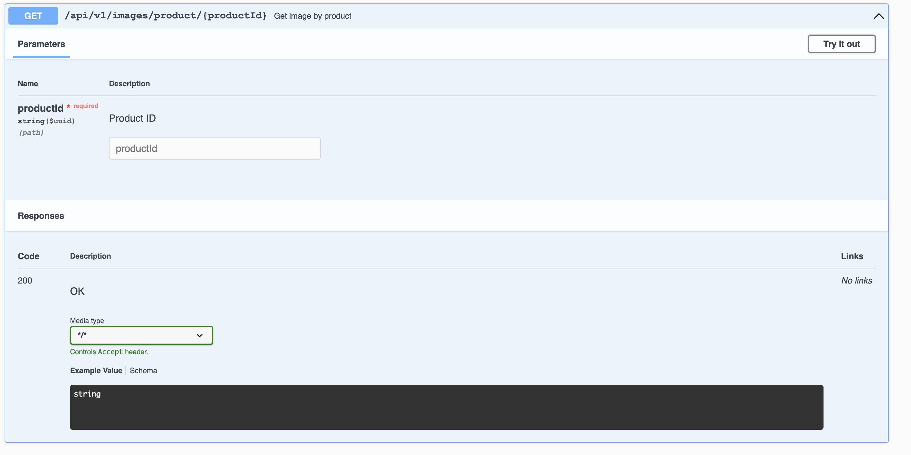

# java-rest-api-shop

Бэкенд REST API для магазина бытовой техники. Написал на Java с Spring Boot, база — PostgreSQL. Всё хранится в реляционной БД с нормальными формами, есть сущности: клиенты, товары, поставщики, адреса и изображения товаров (bytea). Использую репозитории, DTO, мапперы — чистая архитектура, без смешивания слоёв.

API полностью по REST: правильные методы (GET, POST, PUT, PATCH, DELETE), коды ответов, валидация, пагинация где нужно. Swagger-документация генерируется автоматически из аннотаций, доступна по `/swagger-ui.html`.

Проект делал как практическое задание — получился рабочий магазин с CRUD для всех сущностей и обработкой изображений.

### Технологии
- Java 17+
- Spring Boot (Web, Data JPA, Validation)
- PostgreSQL
- Swagger (Springdoc OpenAPI)
- Lombok (для boilerplate)
- Maven

### Как запустить
1. Установи PostgreSQL (или подними в Docker).
2. Создай базу `shop_db` (или измени в `application.properties`).
3. Запусти миграции (если есть Flyway/Liquibase) или таблицы создадутся автоматически через JPA.
4. `mvn spring-boot:run`
5. API доступно на `http://localhost:8080`
6. Swagger: `http://localhost:8080/swagger-ui/index.html`

### Что реализовано
Все эндпоинты под `/api/v1/`:

**Клиенты**  
- POST `/clients` — добавить клиента  
- DELETE `/clients/{id}` — удалить  
- GET `/clients` — все клиенты (с ?limit= &offset=)  
- GET `/clients/search?name=...&surname=...` — поиск по имени/фамилии  
- PATCH `/clients/{id}/address` — изменить адрес  

**Товары**  
- POST `/products` — добавить товар  
- PATCH `/products/{id}/decrease-stock?amount=...` — уменьшить количество  
- GET `/products/{id}` — по id  
- GET `/products` — все доступные  
- DELETE `/products/{id}` — удалить  

**Поставщики**  
- POST `/suppliers` — добавить  
- PATCH `/suppliers/{id}/address` — изменить адрес  
- DELETE `/suppliers/{id}` — удалить  
- GET `/suppliers` — все  
- GET `/suppliers/{id}` — по id  

**Изображения**  
- POST `/images` — добавить (с id товара)  
- PUT `/images/{id}` — заменить  
- DELETE `/images/{id}` — удалить  
- GET `/images/product/{productId}` — изображения товара  
- GET `/images/{id}` — по id (возвращает octet-stream, браузер скачивает)  

Валидация на входные DTO, 400 при ошибках, 404 если не найдено.

### Swagger в деле

Вот как выглядит документация и работа API (скриншоты из реального запуска):

#### 1. Главная страница Swagger UI

#### 2. Пример GET-запроса (список товаров)

#### 3. Пример POST-запроса (добавление клиента)

#### 4. Негативный сценарий (ошибка валидации 400)

Скриншоты лежат в папке `/screenshots`. Если запустишь проект — всё будет работать точно так же.

Если хочешь потестировать — есть готовая Postman-коллекция (ссылка в отдельном репо). Проект рабочий, база заполняется тестовыми данными при старте (если включишь data.sql).

Готов дорабатывать или добавлять фичи — пиши!
